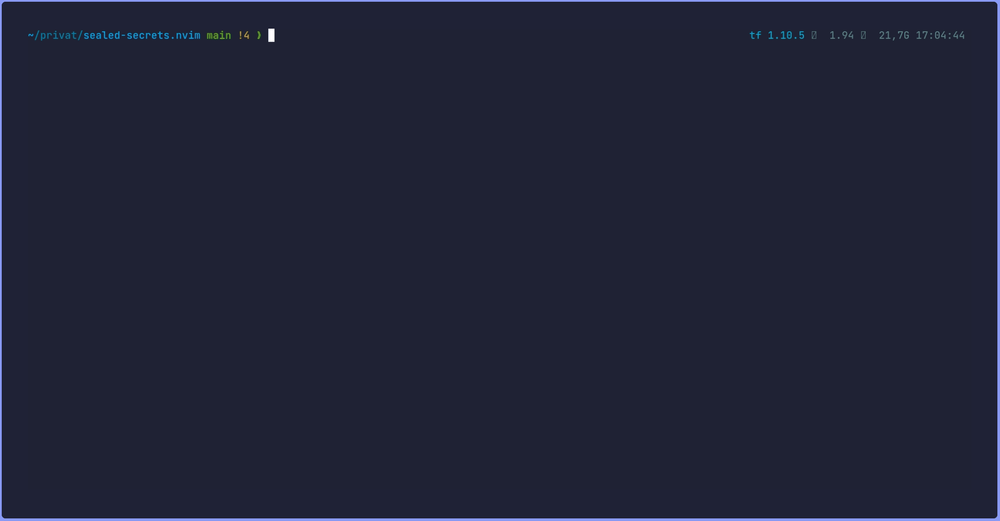
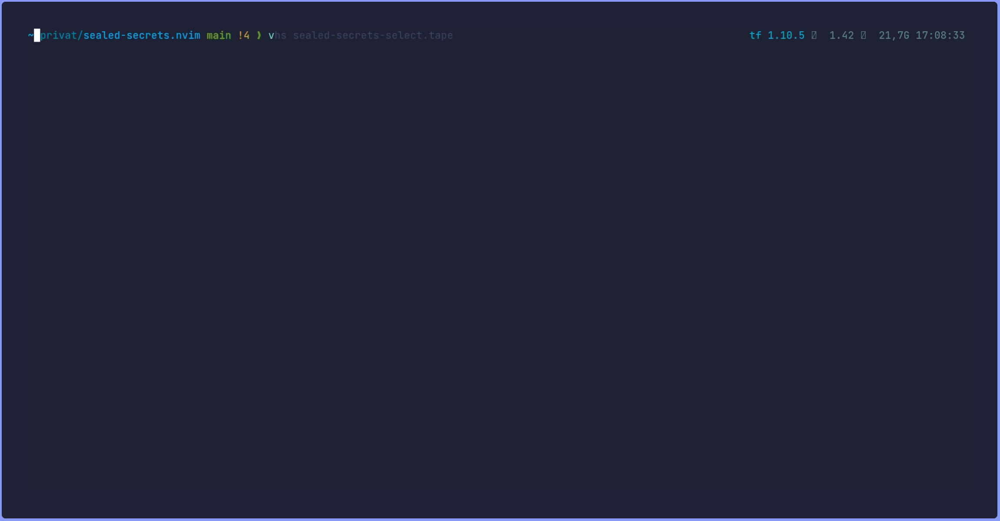

# 💥 sealed-secrets

Neovim plugin that allows the conversion of Kubernetes secrets into sealed-secrets using kubeseal directly within nvim.

## ✨ Features

- Create a new sealed secrets file from an existing secret file.
  - this will transform the hole Secret file into SealedSecret file.



- Mark a secret and convert it into a sealed secret. [shift key] + v
  - this will just transform the selection to a SealedSecret.



## ⚡️ Requirements

- Neovim >= 0.9.4
- kubeseal must be installed as a prerequisite. Installation instructions can be found [here](https://github.com/bitnami-labs/sealed-secrets#installation)

## 📦 Installation

Install the plugin with your package manager:

### [lazy.nvim](https://github.com/folke/lazy.nvim)

```lua:~/.config/nvim/lua/plugins/sealed-secrets.lua

return {
  "tinoschroeter/sealed-secrets.nvim",
  -- dir = "~/projects/sealed-secrets.nvim", -- dev only
  config = function()
    require("sealed-secrets").setup({
      -- the path can also be relative ../../sealedsecrets.pem
      cert_path = "/path/to/your/sealedsecrets.pem"
    })
  end,
}
```

## 🚀 Keymap

- Normal Mode: **leader** ks or :KubesealEncrypt<CR>
- Visual Mode: **leader** ks

## 🔥 development

```bash
git tag -a v1.0.0 -m "Initial release"
git push origin v1.0.0
```
